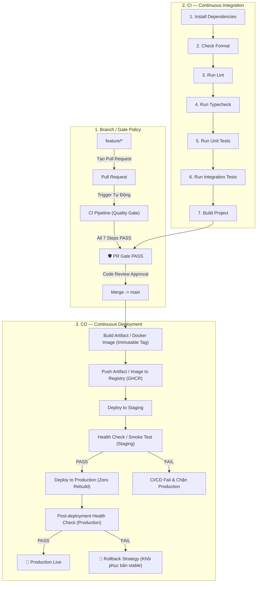

# 🚀 HỆ THỐNG CI/CD PIPELINE & QUALITY GATE DỰ ÁN WEARSY

> **Dự án:** WEARSY - Smart Wardrobe & AI Fashion Assistant  
> **Chủ trì Kỹ thuật & CI/CD:** Võ Thế Dân  
> **Mã dự án:** EXE101 - FA26  
> **Nền tảng CI/CD:** GitHub Actions & GitHub Container Registry (GHCR)  
> **Phiên bản:** v1.0.0  

---

## 1. Tổng quan Kiến trúc Pipeline

Dự án WEARSY được cấu trúc theo dạng Monorepo chuẩn gồm 2 thành phần chính:
- **Backend Service:** NestJS 10, TypeScript 5, TypeORM, PostgreSQL 13+.
- **Mobile Client:** Flutter 3.24.x, Dart 3.x, Clean Architecture & Provider.

Hệ thống CI/CD được thiết kế tuân thủ nghiêm ngặt **Enterprise DevOps Lifecycle**:



---

## 2. Bảng tổng hợp Công nghệ, Build System & Commands

| Hạng mục | Backend (NestJS / TypeScript) | Mobile (Flutter / Dart) |
| :--- | :--- | :--- |
| **Package Manager** | `npm` (Node.js 20.x, `package-lock.json`) | `flutter pub` (`pubspec.lock`) |
| **Framework / Build System** | NestJS CLI (`@nestjs/cli`), TypeScript (`tsc`) | Flutter SDK 3.24.3, Gradle / Android SDK |
| **1. Install Dependencies** | `npm ci` | `flutter pub get` |
| **2. Check Format** | `npm run format:check` (`prettier --check`) | `dart format --output=none --set-exit-if-changed lib test` |
| **3. Run Lint** | `npm run lint` (`eslint`) | `flutter analyze --no-fatal-infos` |
| **4. Run Typecheck** | `npm run typecheck` (`tsc --noEmit`) | `dart analyze --fatal-warnings lib test` |
| **5. Run Unit Tests** | `npm test -- --coverage` (`jest`) | `flutter test test/auth_validation_test.dart test/smart_fit_test.dart --coverage` |
| **6. Run Integration Tests**| `npm run test:e2e` (`jest-e2e` & `/health`) | `flutter test test/widget_test.dart` |
| **7. Build Project** | `npm run build` (`nest build` -> `dist/`) | `flutter build apk --debug --no-tree-shake-icons` |

---

## 3. Chi tiết CI — Continuous Integration (PR Gate)

File cấu hình: [`.github/workflows/ci.yml`](file:///d:/FPTDocuments/FA26/EXE101/Project%20WEARSY/.github/workflows/ci.yml)

### 3.1. Thứ tự 7 bước bắt buộc
Pipeline chạy tự động khi tạo mới hoặc cập nhật bất kỳ Pull Request nào vào nhánh `main` hoặc `develop`:
1. **Install dependencies**: Cài đặt gói thư viện chính xác từ lockfile (`npm ci` / `flutter pub get`).
2. **Check format**: Kiểm tra quy chuẩn trình bày code mà không tự ý ghi đè (`prettier --check` / `dart format`).
3. **Run lint**: Phân tích tĩnh code để phát hiện lỗi cú pháp, anti-patterns (`eslint` / `flutter analyze`).
4. **Run typecheck**: Kiểm tra tính toàn vẹn kiểu dữ liệu (`tsc --noEmit` / `dart analyze`).
5. **Run unit tests**: Kiểm tra logic nghiệp vụ từng hàm, service (bảo đảm độ phủ test).
6. **Run integration tests**: Kiểm tra luồng tương tác giữa các thành phần (`test:e2e` kiểm tra API endpoint và sức khỏe hệ thống; `widget_test` kiểm tra giao diện).
7. **Build project**: Biên dịch toàn bộ project ra artifact cuối (`dist/` cho Backend, APK cho Mobile).

### 3.2. Yêu cầu & Cơ chế PR Gate
- **Strict Failure**: Bất kỳ bước nào trong 7 bước trên bị lỗi, toàn bộ CI Job sẽ thất bại ngay lập tức.
- **Required Check / PR Gate**: Job `pull-request-gate` tổng hợp kết quả của cả `backend-ci` và `mobile-ci`. Nếu có bất kỳ lỗi nào, Gate sẽ trả về mã lỗi `exit 1` và khóa tính năng Merge trên Pull Request.
- **Không Bypass**: Nghiêm cấm gộp nhánh trực tiếp mà không thông qua CI Gate.

---

## 4. Chi tiết CD — Continuous Deployment

File cấu hình: [`.github/workflows/cd.yml`](file:///d:/FPTDocuments/FA26/EXE101/Project%20WEARSY/.github/workflows/cd.yml)

### 4.1. Quy trình CD chuẩn khi Merge vào `main`
```
Merge → main
    ↓
Build artifact / Docker image (Immutable Tag: sha-<commit_sha>)
    ↓
Push artifact / image to registry (ghcr.io)
    ↓
Deploy to Staging
    ↓
Health Check / Smoke Test (Staging)
    ↓
PASS
    ↓
Deploy to Production (Triển khai chính image đã pass Staging - Không build lại)
    ↓
Post-deployment Health Check (Production)
    ↓
[Nếu thất bại] → Kích hoạt Rollback Strategy (Khôi phục image prod-stable)
```

### 4.2. Các tiêu chuẩn CD Enterprise đạt được
1. **Zero Rebuild (Ưu tiên deploy chính artifact đã kiểm tra)**:
   - Image backend được build một lần duy nhất tại job `build-and-push` với định danh bất biến `ghcr.io/<owner>/wearsy/backend:sha-<commit_sha>`.
   - Cả môi trường Staging và Production đều triển khai cùng một container image tag này, loại trừ tuyệt đối sự sai lệch môi trường (configuration drift).
2. **Thứ tự tuần tự nghiêm ngặt (Staging trước Production)**:
   - Job `deploy-production` có `needs: [build-and-push, deploy-staging]`.
   - Production chỉ chạy khi Staging deploy và smoke test đạt 100% `success`.
3. **Health Check & Smoke Test**:
   - Sử dụng endpoint `/api/v1/health` để kiểm tra độ sẵn sàng của ứng dụng sau triển khai.
   - Cơ chế Polling Retry: 5 lần thử với khoảng cách 10 giây/lần.
4. **Chiến lược Rollback tự động (Rollback Strategy)**:
   - Job `production-rollback` tự động kích hoạt khi `deploy-production` hoặc post-deployment health check gặp sự cố (`if: failure()`).
   - Tự động gọi webhook hoặc chỉ định khôi phục về tag `prod-stable` trước đó, bảo đảm thời gian gián đoạn dịch vụ (downtime) ở mức tối thiểu.
5. **Chiến lược Database Migration an toàn (Safe Migration Strategy)**:
   - Script runner: [`database/migrate.js`](file:///d:/FPTDocuments/FA26/EXE101/Project%20WEARSY/database/migrate.js).
   - Sử dụng cơ chế Transaction (`BEGIN ... COMMIT`) an toàn: nếu có lỗi bất ngờ, tự động kích hoạt `ROLLBACK` để bảo toàn dữ liệu.
   - Hỗ trợ chế độ `--dry-run` để kiểm tra schema trong CI trước khi áp dụng vào cơ sở dữ liệu thật.
6. **Bảo mật Secrets**:
   - Hoàn toàn không lưu mật khẩu hay API Key trong mã nguồn.
   - Tách biệt Secrets theo GitHub Environments: `staging` và `production`.

---

## 5. Branch & Gate Policy

### 5.1. Mô hình phân nhánh
```
feature/*  --->  Pull Request  --->  CI Required Checks  --->  Code Review  --->  Merge main  --->  CD Pipeline
```

### 5.2. Chính sách bảo vệ nhánh `main` (Branch Protection Rules)
Cấu hình thủ công trên GitHub Repository (**Settings** -> **Branches** -> **Add branch protection rule**):
- **Branch name pattern:** `main`
- ✅ **Require a pull request before merging**: Bắt buộc tạo PR, không cho phép `git push` trực tiếp.
- ✅ **Require approvals**: Yêu cầu tối thiểu 1 code review approval từ thành viên phụ trách.
- ✅ **Require status checks to pass before merging**:
  - Tích chọn: `🛡️ Pull Request Gate (All Checks Must Pass)`
  - Tích chọn: `Backend CI (Install, Format, Lint, Typecheck, Unit, E2E, Build)`
  - Tích chọn: `Mobile CI (Install, Format, Lint, Typecheck, Unit, Integration, Build)`
- ✅ **Require branches to be up to date before merging**: Đảm bảo PR được rebase/merge code mới nhất của `main`.
- ✅ **Do not allow bypassing the above settings**: Áp dụng quy tắc cho cả quản trị viên (Admin).

---

## 6. Hướng dẫn chạy & kiểm thử CI/CD

### 6.1. Kiểm thử cục bộ (Local Development)

Trước khi commit và tạo Pull Request, lập trình viên chạy chuỗi lệnh sau:

#### A. Kiểm tra Backend (NestJS)
```bash
cd wearsy-backend

# 1. Cài đặt dependencies
npm ci

# 2. Kiểm tra format
npm run format:check
# (Nếu cần tự format: npm run format)

# 3. Kiểm tra lint
npm run lint

# 4. Kiểm tra typecheck
npm run typecheck

# 5. Chạy unit tests
npm test

# 6. Chạy integration tests (bao gồm /health test)
npm run test:e2e

# 7. Build dự án
npm run build

# Kiểm tra migration an toàn ở chế độ dry-run
npm run db:migrate:dry
```

#### B. Kiểm tra Mobile (Flutter)
```bash
cd wearsy_mobile

# 1. Cài đặt dependencies
flutter pub get

# 2. Kiểm tra format
dart format --output=none --set-exit-if-changed lib test

# 3. Kiểm tra lint
flutter analyze --no-fatal-infos

# 4. Kiểm tra typecheck
dart analyze --fatal-warnings lib test

# 5. Chạy unit tests
flutter test test/auth_validation_test.dart test/smart_fit_test.dart

# 6. Chạy integration / widget tests
flutter test test/widget_test.dart

# 7. Build dự án kiểm tra (Smoke check)
flutter build apk --debug --no-tree-shake-icons
```

---

## 7. Cấu hình GitHub Secrets & Environments (Hướng dẫn thủ công)

Do các thiết lập này thuộc về quyền quản trị của Repository và Cloud Provider, Quản trị viên dự án thực hiện cấu hình tại giao diện GitHub:

### 7.1. Cấu hình Environments (Settings -> Environments)
Tạo 2 môi trường:
1. `staging`
2. `production` (Khuyến nghị bật: **Required reviewers** trước khi deploy)

### 7.2. Cấu hình Repository Secrets (Settings -> Secrets and variables -> Actions)

| Tên Secret | Mô tả | Môi trường |
| :--- | :--- | :---: |
| `GEMINI_API_KEY` | Khóa API Google Gemini AI cho AI Outfit Engine | All |
| `STAGING_DEPLOY_WEBHOOK_URL` | Webhook URL kích hoạt reload container Staging (Render, Railway, Portainer, v.v.) | Staging |
| `STAGING_API_URL` | Domain API Staging để chạy Smoke Test (VD: `https://staging-api.wearsy.app`) | Staging |
| `STAGING_DB_HOST` | Địa chỉ PostgreSQL Staging (dùng cho Safe Migration) | Staging |
| `STAGING_DB_USERNAME` | Tên đăng nhập DB Staging | Staging |
| `STAGING_DB_PASSWORD` | Mật khẩu DB Staging | Staging |
| `STAGING_DB_DATABASE` | Tên Database Staging | Staging |
| `PRODUCTION_DEPLOY_WEBHOOK_URL`| Webhook URL triển khai chính thức lên Production | Production |
| `PRODUCTION_API_URL` | Domain API Production để chạy Post-deployment Health Check | Production |
| `PROD_DB_HOST` | Địa chỉ PostgreSQL Production | Production |
| `PROD_DB_USERNAME` | Tên đăng nhập DB Production | Production |
| `PROD_DB_PASSWORD` | Mật khẩu DB Production | Production |
| `PROD_DB_DATABASE` | Tên Database Production | Production |
| `ROLLBACK_WEBHOOK_URL` | Webhook kích hoạt Rollback khẩn cấp khi Production gặp sự cố | Production |

> [!NOTE]
> Hệ thống CD Workflow đã được trang bị cơ chế **Mock & Dry-Run Fallback**: nếu các Webhook hoặc Database Secrets chưa được cấu hình, pipeline sẽ tự động thực thi chế độ kiểm thử xác thực cấu trúc (container dry-run) mà không gây dừng đột ngột, giúp đội ngũ có thể kiểm tra trọn vẹn luồng pipeline ngay lập tức.
