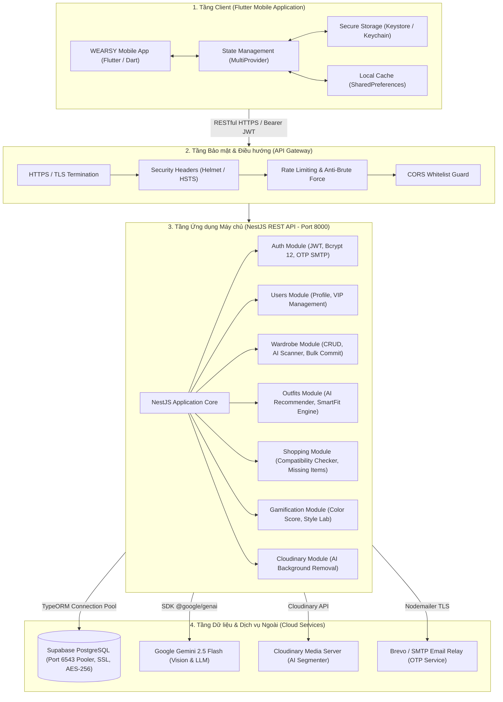
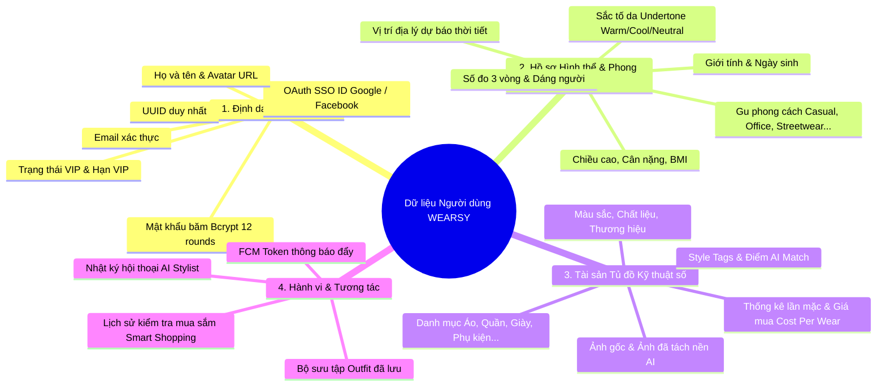
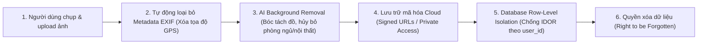
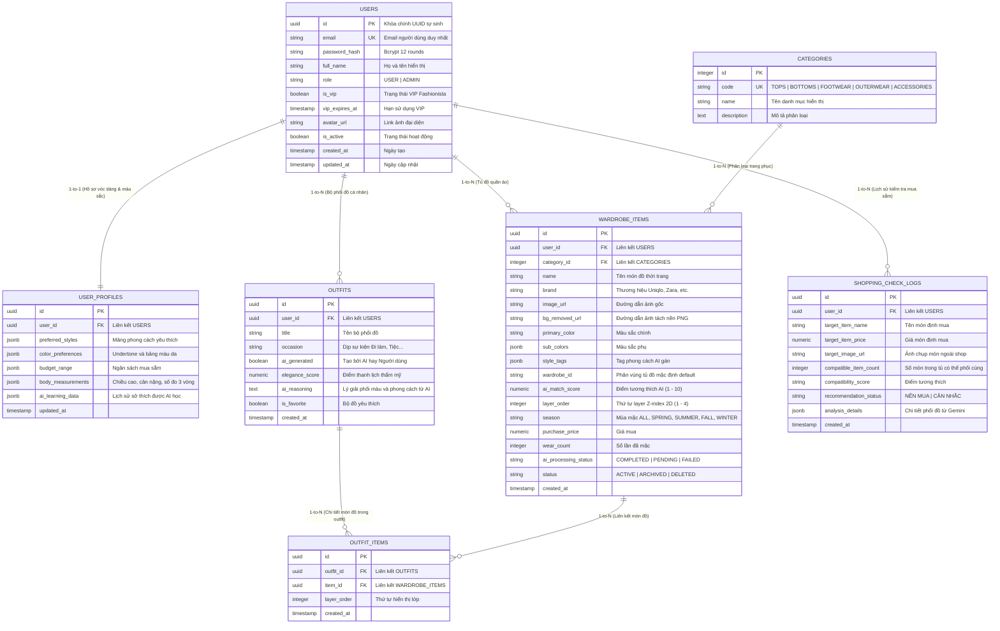
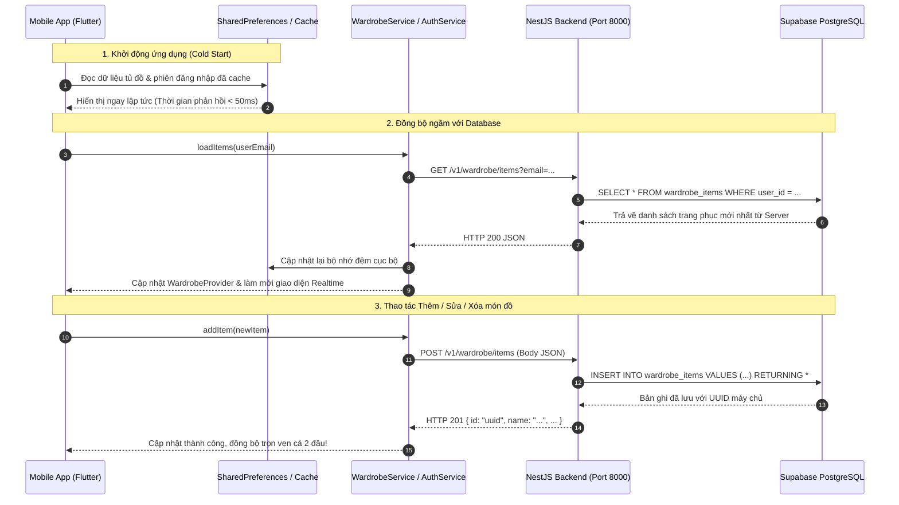

# TÀI LIỆU KỸ THUẬT DỰ ÁN WEARSY
## (Technical Specification & System Architecture Documentation)

> **Tên dự án:** WEARSY - Smart Wardrobe & AI Fashion Assistant  
> **Mã môn / Dự án:** EXE101 - FA26  
> **Chủ trì Kỹ thuật & An toàn Thông tin:** Võ Thế Dân  
> **Phiên bản tài liệu:** v2.5.0 (Cập nhật chuẩn hóa Kiến trúc Server Database & Bảo mật)  
> **Ngày cập nhật:** 30/09/2026  

---

## 1. Tổng quan Dự án & Mục tiêu Hệ thống

### 1.1. Giới thiệu dự án
**WEARSY** là nền tảng trợ lý thời trang cá nhân và quản lý tủ đồ kỹ thuật số thông minh thế hệ mới, tích hợp trí tuệ nhân tạo đa phương thức (**Multimodal AI Computer Vision & Large Language Models**). Hệ thống giải quyết bài toán *"Hôm nay mặc gì?"*, tối ưu hóa chi phí mua sắm thời trang (*Cost Per Wear - CPW*), và cá nhân hóa trải nghiệm phối đồ dựa trên vóc dáng, màu sắc da, thời tiết và ngữ cảnh sự kiện thực tế.

Các trụ cột tính năng đột phá:
1. **Số hóa tủ đồ thông minh**: Chụp 1 chạm bóc tách nền vật thể bằng Cloudinary AI; hoặc chụp toàn cảnh tủ đồ bằng tính năng **Bulk Scan** (sử dụng Gemini 2.5 Flash Vision nhận diện cùng lúc hàng chục món đồ).
2. **AI Stylist & Smart Fit 2D Canvas**: Khuyến nghị phối đồ theo bối cảnh kèm bảng dựng trang phục trực quan dạng 2D Layering Canvas, tự động tính toán tỷ lệ tương quan cơ thể chuẩn người Việt / Châu Á.
3. **Smart Shopping Check**: Chụp ảnh món đồ định mua bên ngoài để AI phân tích độ hòa hợp với toàn bộ tủ đồ sẵn có, đưa ra khuyến nghị "Nên Mua" hay "Không Nên Mua" nhằm tránh lãng phí.
4. **Gamification & Color Score**: Phân tích sắc thái da (Skin Undertone), chấm điểm quy tắc phối màu chuẩn 60-30-10, phân tích bảng màu 4 mùa (Spring / Summer / Autumn / Winter) và thử thách thời trang bền vững.

### 1.2. Mục tiêu kỹ thuật cốt lõi
- **Kiến trúc bền vững (Decoupled Client-Server)**: Tách biệt hoàn toàn tầng Client (Flutter Mobile) và Server (NestJS Framework + TypeORM + PostgreSQL Cloud Database).
- **Lưu trữ tập trung trên Server Database (100% Persistence)**: Mọi dữ liệu tài khoản, đăng ký, đăng nhập SSO, gói VIP, và từng món đồ trong tủ đồ đều được đồng bộ hóa và lưu vĩnh viễn trên Supabase PostgreSQL Database.
- **Bảo mật dữ liệu cá nhân & hình ảnh chuẩn quốc tế**: Tuân thủ nguyên tắc bảo vệ quyền riêng tư, loại bỏ metadata nhạy cảm, mã hóa dữ liệu khi nghỉ (AES-256) và trên đường truyền (TLS/HTTPS).
- **Trải nghiệm di động tối ưu**: Dark Mode cao cấp, hoạt động mượt mà với cơ chế Cache-First kết hợp Background Synchronization.

---

## 2. Kiến trúc Tổng thể Hệ thống (System Architecture)

### 2.1. Sơ đồ Kiến trúc 3 Lớp (3-Tier Architecture)



### 2.2. Thông số Môi trường Máy chủ

| Thành phần | Cấu hình kỹ thuật | Ghi chú |
| :--- | :--- | :--- |
| **API Host** | `http://localhost:8000` (Local) / Production Domain | Prefix `/v1` |
| **Swagger UI** | `http://localhost:8000/v1/docs` | OpenAPI 3.0 Interactive Docs |
| **Database** | Supabase Cloud PostgreSQL 15+ (Transaction Pooler Port `6543`) | Hỗ trợ IPv4/IPv6, SSL bắt buộc |
| **Mobile API Target** | `http://10.0.2.2:8000/v1` (Android Emulator) / LAN IP | Tự động phát hiện môi trường |

---

## 3. Xác định Thông tin Cần Lưu trữ về Người Dùng (User Data Modeling)

Để phục vụ trải nghiệm thời trang cá nhân hóa sâu sắc, hệ thống WEARSY phân loại và quản lý dữ liệu người dùng thành **4 nhóm thông tin nghiệp vụ rõ ràng**:



### 3.1. Nhóm 1: Thông tin Định danh & Quản trị Tài khoản (Identity & Authentication)
- **`id` (UUID)**: Khóa chính định danh duy nhất của người dùng trên toàn hệ thống.
- **`email`**: Định danh đăng nhập chính, định dạng chuẩn RFC 5322.
- **`password_hash`**: Chuỗi băm mật khẩu một chiều bằng thuật toán `bcrypt` với 12 salt rounds (tuyệt đối không lưu mật khẩu gốc).
- **`sso_provider` & `sso_id`**: Định danh tài khoản mạng xã hội (Google Sub ID, Facebook App-Scoped User ID).
- **`full_name`**: Họ tên hiển thị của người dùng (có thể cập nhật bất kỳ lúc nào).
- **`avatar_url`**: Đường dẫn ảnh đại diện cá nhân trên CDN.
- **`role`**: Phân quyền hệ thống (`USER`, `VIP_USER`, `ADMIN`).
- **`is_vip` & `vip_expires_at`**: Trạng thái kích hoạt gói VIP Fashionista và thời hạn gói (được lưu trực tiếp trong bảng `users` trên PostgreSQL).
- **`is_active` & `created_at`**: Trạng thái tài khoản và mốc thời gian đăng ký.

### 3.2. Nhóm 2: Hồ sơ Cá nhân hóa Hình thể & Thời trang (Body & Style Profile)
*(Được lưu tại bảng `user_profiles` dưới dạng cấu trúc JSONB linh hoạt để phục vụ Smart Fit & AI Recommender)*
- **Chỉ số sinh trắc học**:
  - Giới tính (Nam, Nữ, Unisex).
  - Chiều cao (cm), Cân nặng (kg) → Hệ thống tự động tính **BMI** và **Body Frame** (Gầy, Cân đối, Hơi thừa cân, Đầy đặn).
  - Số đo 3 vòng: Ngực (Bust/Chest), Eo (Waist), Mông (Hips) theo chuẩn cm.
  - Phân loại dáng người (Body Shape): Đồng hồ cát (Hourglass), Quả lê (Pear), Chữ nhật (Rectangle), Tam giác ngược (Inverted Triangle), Quả táo (Apple).
- **Sắc tố da & Bảng màu cá nhân (Color Profile)**:
  - Sắc tố da (*Skin Undertone*): `WARM` (Ấm), `COOL` (Lạnh), `NEUTRAL` (Trung tính).
  - Mùa sắc thái (*Seasonal Color Palette*): Xuân, Hạ, Thu, Đông (Spring / Summer / Autumn / Winter).
- **Gu thời trang (Preferred Styles)**:
  - Danh sách nhãn phong cách: *Casual, Minimalism, Streetwear, Smart Casual, Business Formal, Y2K, Vintage, Sporty*.
- **Ngữ cảnh môi trường**:
  - Thành phố / Vị trí địa lý để backend kết nối API thời tiết thời gian thực, đưa ra lời khuyên trang phục phù hợp với nhiệt độ và độ ẩm ngoài trời.

### 3.3. Nhóm 3: Dữ liệu Tài sản Tủ đồ (Wardrobe Items & Assets)
*(Được lưu tại bảng `wardrobe_items`, gắn kết chặt chẽ với `user_id`)*
- **Thuộc tính sản phẩm**: Tên trang phục, Thương hiệu (Zara, Uniqlo, H&M,...), Danh mục (`TOPS`, `BOTTOMS`, `OUTERWEAR`, `FOOTWEAR`, `ACCESSORIES`), Màu sắc chính, Màu phụ, Chất liệu (Cotton, Denim, Linen, Da,...), Mùa mặc phù hợp (`SPRING`, `SUMMER`, `FALL`, `WINTER`, `ALL`).
- **Dữ liệu Hình ảnh Đa phiên bản**:
  - `image_url`: Ảnh gốc do người dùng chụp.
  - `bg_removed_url`: Ảnh trong suốt (transparent PNG) đã được bóc tách phông nền bằng AI, dùng để xếp lớp trong Canvas 2D.
- **Trí tuệ nhân tạo (AI Metadata)**:
  - `ai_match_score`: Điểm tương thích phối đồ do AI đánh giá (thang điểm 1 - 10).
  - `style_tags`: Mảng các tag phong cách AI tự động gán.
  - `layer_order`: Thứ tự phân lớp (1: Base Layer, 2: Outer Layer, 3: Footwear, 4: Accessories).
- **Tài chính thời trang & Mức độ sử dụng**:
  - `purchase_price`: Giá tiền mua món đồ.
  - `wear_count`: Số lần đã mặc thực tế.
  - Chỉ số **Cost Per Wear (CPW)** = `purchase_price / wear_count` (giúp người dùng theo dõi hiệu quả sử dụng tủ đồ).

### 3.4. Nhóm 4: Hành vi & Lịch sử tương tác (Interaction & Behavior Data)
- **Bộ phối đồ đã lưu (`outfits` & `outfit_items`)**: Tên outfit, dịp mặc (Đi làm, Dự tiệc, Đi chơi, Hẹn hò), danh sách các món đồ cấu thành, điểm thẩm mỹ (`elegance_score`) và lý giải phong cách từ AI.
- **Nhật ký kiểm tra mua sắm (`shopping_check_logs`)**: Ảnh chụp món đồ dự định mua, giá cả, số lượng món đồ trong tủ đồ có thể phối cùng, và kết luận khuyến nghị ("NÊN MUA" / "CÂN NHẮC").
- **Lịch sử Stylist AI**: Các truy vấn tư vấn thời trang cá nhân hóa.

---

## 4. Bảo mật Hình ảnh và Quyền Riêng tư Cá nhân (Photo & Personal Privacy Security)

Đối với ứng dụng thời trang AI đòi hỏi người dùng tải lên ảnh chụp quần áo, không gian sống và cung cấp số đo hình thể, bài toán an toàn thông tin là **trọng tâm thiết kế kỹ thuật** của dự án WEARSY.



### 4.1. Các Nguy cơ An toàn Thông tin Thực tế
1. **Lộ không gian riêng tư qua ảnh chụp**: Người dùng thường chụp ảnh đồ đạc trong phòng ngủ hoặc trước gương cá nhân. Nếu lưu trữ ảnh nguyên gốc, không gian sinh hoạt cá nhân hoặc đồ vật nhạy cảm có thể bị người khác nhìn thấy.
2. **Lộ tọa độ địa lý qua EXIF Metadata**: Camera smartphone tự động gắn thông tin EXIF (tọa độ GPS chính xác kinh độ/vĩ độ nơi chụp, mẫu thiết bị, thời gian). Kẻ xấu có thể khai thác để truy ra địa chỉ nhà riêng của người dùng.
3. **Rò rỉ số đo hình thể (Body Biometrics)**: Chiều cao, cân nặng, số đo 3 vòng là dữ liệu riêng tư nhạy cảm.
4. **Tấn công truy cập tham chiếu trực tiếp đối tượng (IDOR - Insecure Direct Object References)**: Người dùng A sửa đổi ID trên URL/API để xem hoặc xóa ảnh tủ đồ của người dùng B.
5. **Nghe lén đường truyền (Man-in-the-Middle)**: Bị đánh cắp token xác thực và hình ảnh khi kết nối Wi-Fi công cộng.

### 4.2. Giải pháp Kỹ thuật Bảo vệ Toàn diện của WEARSY

#### A. Bảo mật Hình ảnh Tủ đồ (Photo Privacy Pipeline)
- **Tự động bóc tách và loại bỏ phông nền (AI Background Segmentation)**:
  - Khi người dùng tải ảnh lên qua `/v1/wardrobe/upload`, luồng xử lý kích hoạt Cloudinary AI / Gemini AI ngay lập tức để tách lấy vật phẩm trang phục, **xóa bỏ 100% phông nền đằng sau** (giường ngủ, tủ kệ, gương cá nhân).
  - Hệ thống chỉ lưu và hiển thị ảnh vật thể thời trang dạng PNG trong suốt (`bg_removed_url`).
- **Lọc sạch siêu dữ liệu EXIF (EXIF Metadata Stripping)**:
  - Quy trình upload trên server sử dụng bộ đệm (stream processing) tự động cắt bỏ toàn bộ thẻ GPS tags, máy ảnh model, thời gian chụp thực tế trước khi tải lên kho lưu trữ đám mây.
- **Kho lưu trữ phân quyền & Signed URL**:
  - Không mở chế độ Public List trên Storage Bucket.
  - Đường dẫn truy cập ảnh được cấu hình kiểm soát truy cập và bảo vệ bằng chữ ký số có thời hạn nếu cần thiết.

#### B. Kiểm soát Truy cập & Chống Lỗ hổng IDOR (Data Isolation)
- **Cô lập dữ liệu cấp người dùng (User-Level Tenant Isolation)**:
  - Ở mọi controller (`WardrobeController`, `UsersController`, `OutfitsController`), hệ thống trích xuất `user_id` trực tiếp từ JWT Payload đã được ký số mật mã.
  - Mọi truy vấn database TypeORM bắt buộc phải kèm mệnh đề:
    ```sql
    WHERE user_id = :current_user_id AND status = 'ACTIVE'
    ```
  - Người dùng tuyệt đối không thể truy vấn hoặc can thiệp vào tủ đồ hay thông tin của người dùng khác dù biết UUID của món đồ.

#### C. Mã hóa Toàn diện & Bảo vệ Đường truyền (Encryption Standards)
- **Mã hóa đường truyền (In-Transit Encryption)**: 100% các cuộc gọi API giữa ứng dụng Flutter và máy chủ NestJS đều bắt buộc qua giao thức **HTTPS / TLS 1.3**.
- **Mã hóa cơ sở dữ liệu khi nghỉ (At-Rest Encryption)**: Cơ sở dữ liệu Supabase PostgreSQL lưu trữ trên ổ đĩa được mã hóa bằng tiêu chuẩn công nghiệp **AES-256**.
- **Bảo mật thiết bị di động (Mobile Client Protection)**:
  - JWT Access Token được lưu trong vùng nhớ mã hóa phần cứng an toàn: **Android Keystore** và **iOS Keychain** thông qua thư viện `flutter_secure_storage`.
  - Tích hợp `FLAG_SECURE` (`flutter_windowmanager_plus`) ở các màn hình tài khoản để ngăn chặn ứng dụng độc hại chụp trộm màn hình điện thoại.

#### D. Quyền Riêng tư & Tuân thủ Pháp lý (Privacy Compliance)
- **Quyền được lãng quên (Right to be Forgotten)**:
  - Đáp ứng nghiêm ngặt **Nghị định 13/2023/NĐ-CP** về Bảo vệ dữ liệu cá nhân tại Việt Nam và tiêu chuẩn **GDPR**.
  - Người dùng có quyền xóa vĩnh viễn tài khoản trong mục Cài đặt. Khi thực hiện, hệ thống tự động:
    1. Xóa toàn bộ ảnh gốc và ảnh tách nền trên Cloudinary/Storage.
    2. Xóa các bản ghi liên kết trong các bảng `wardrobe_items`, `outfit_items`, `outfits`, `user_profiles`.
    3. Hủy bỏ vĩnh viễn thông tin cá nhân trong bảng `users`.
- **Cam kết sử dụng AI**: Dữ liệu hình ảnh và số đo của người dùng không bao giờ được chia sẻ cho bên thứ ba cho mục đích tiếp thị hoặc quảng cáo ngoài ý muốn.

---

## 5. Thiết kế Cơ sở Dữ liệu Chi tiết (Database Schema)

Cơ sở dữ liệu quan hệ được triển khai trên **Supabase PostgreSQL** với các extensions hỗ trợ UUID (`uuid-ossp`) và mã hóa (`pgcrypto`).

### 5.1. Sơ đồ Thực thể - Mối quan hệ (ERD)



---

## 6. Đặc tả RESTful API Endpoints (API Specifications)

Hệ thống cung cấp hệ thống REST API hoàn chỉnh, tất cả endpoints đều có tiền tố `/v1` và hỗ trợ đầy đủ Swagger OpenAPI 3.0 tại `http://localhost:8000/v1/docs`.

### 6.1. Danh sách Endpoints Thực tế

#### A. Nhóm Xác thực & Tài khoản (`/v1/auth`)
| Phương thức | Đường dẫn | Chức năng | Cơ chế bảo mật |
| :--- | :--- | :--- | :--- |
| `POST` | `/auth/register` | Đăng ký tài khoản mới bằng Email + Mật khẩu | Bcrypt 12 rounds, lưu PostgreSQL, cấp JWT |
| `POST` | `/auth/login` | Đăng nhập hệ thống bằng Email + Mật khẩu | So khớp Bcrypt, cấp JWT 24h |
| `POST` | `/auth/google` | Đăng nhập / Đăng ký nhanh qua Google SSO | Xác thực Google Token, upsert vào DB |
| `POST` | `/auth/facebook` | Đăng nhập / Đăng ký nhanh qua Facebook SSO | Xác thực Facebook Token, upsert vào DB |
| `POST` | `/auth/send-otp` | Gửi mã xác thực OTP 6 số qua Brevo SMTP Relay | TTL 5 phút, giới hạn 3 lần/phút |
| `POST` | `/auth/verify-otp` | Kiểm tra mã OTP người dùng nhập | Giới hạn 5 lần thử sai, hủy mã sau dùng |
| `POST` | `/auth/change-password` | Đổi mật khẩu tài khoản | Kiểm tra mật khẩu cũ, băm mới, thu hồi token cũ |
| `POST` | `/auth/logout` | Đăng xuất người dùng | Đưa token vào In-Memory Revocation Blacklist |

#### B. Nhóm Hồ sơ Người dùng & Gói VIP (`/v1/users`)
| Phương thức | Đường dẫn | Chức năng | Quyền & Tham số |
| :--- | :--- | :--- | :--- |
| `GET` | `/users/profile` | Lấy thông tin cá nhân và trạng thái VIP từ PostgreSQL | `?email=...` hoặc Bearer Token |
| `PUT` | `/users/profile` | Cập nhật họ tên, ảnh đại diện trên PostgreSQL | Body: `{ email, full_name, avatar_url }` |
| `POST` | `/users/upgrade-vip` | Nâng cấp tài khoản lên VIP 1 năm bằng Coupon `WEARSY` | Body: `{ email, coupon: "WEARSY" }` |

#### C. Nhóm Quản lý Tủ đồ Quần áo (`/v1/wardrobe`)
| Phương thức | Đường dẫn | Chức năng | Phản hồi & Lưu trữ |
| :--- | :--- | :--- | :--- |
| `GET` | `/wardrobe/items` | Lấy toàn bộ danh sách quần áo của user từ PostgreSQL | Trả về mảng JSON trang phục kèm màu, điểm AI |
| `POST` | `/wardrobe/items` | Thêm món đồ mới trực tiếp vào PostgreSQL | Lưu các trường: tên, brand, color, category, image |
| `PUT` | `/wardrobe/items/:id` | Cập nhật thông tin món đồ trên Database | Cập nhật theo `id` trang phục |
| `DELETE` | `/wardrobe/items/:id` | Xóa món đồ khỏi tủ đồ (Soft-delete) | Chuyển `status = 'DELETED'` |
| `DELETE` | `/wardrobe/items` | **Reset toàn bộ tủ đồ** về trạng thái trắng trên Database | Xóa/ẩn toàn bộ đồ của user (`?email=...`) |
| `POST` | `/wardrobe/upload` | Tải ảnh lên và tự động tách nền AI qua Cloudinary | Trả về `raw_image_url` và `bg_removed_url` |
| `POST` | `/wardrobe/scan-bulk` | **Bulk Scan**: Chụp toàn bộ tủ đồ qua 1 bức ảnh | Gemini Vision nhận diện đa vật thể, trả danh sách |
| `POST` | `/wardrobe/bulk-commit` | Lưu hàng loạt món đồ từ kết quả Bulk Scan vào Database | Thực hiện Batch Insert vào `wardrobe_items` |

#### D. Nhóm Tư vấn Mua sắm Thông minh (`/v1/shopping`)
| Phương thức | Đường dẫn | Chức năng | Mô tả AI |
| :--- | :--- | :--- | :--- |
| `POST` | `/shopping/compatibility-check` | Kiểm tra độ hòa hợp của món đồ định mua | Gemini 2.5 Flash đối soát với tủ đồ hiện có |
| `GET` | `/shopping/missing-items` | Gợi ý những món còn thiếu để hoàn thiện phong cách | Phân tích các khoảng trống trong tủ đồ |
| `GET` | `/shopping/history` | Lấy lịch sử các lần kiểm tra mua sắm | Đọc từ bảng `shopping_check_logs` |
| `GET` | `/shopping/sample-products` | Danh sách sản phẩm mẫu để trải nghiệm thử | Danh mục demo phục vụ thử nghiệm tính năng |

#### E. Nhóm Gamification & Chấm điểm Màu sắc (`/v1/gamification`)
| Phương thức | Đường dẫn | Chức năng | Thuật toán |
| :--- | :--- | :--- | :--- |
| `POST` | `/gamification/color-score` | Chấm điểm độ hòa hợp màu sắc của trang phục | Quy tắc tỷ lệ 60-30-10 & Bảng màu 4 Mùa |
| `GET` | `/gamification/challenges` | Danh sách thử thách thời trang bền vững | Tái sử dụng đồ, giảm thiểu Cost Per Wear |

---

## 7. Cơ chế Đồng bộ hóa Client - Server (Mobile-Backend Synchronization)

Để đảm bảo dữ liệu luôn nhất quán giữa ứng dụng Flutter và máy chủ PostgreSQL, hệ thống áp dụng cơ chế **Offline-First with Remote Synchronization**:



### 7.1. Xử lý Trạng thái Tài khoản Mới (Zero-State Experience)
- Khi một người dùng mới đăng ký hoặc đăng nhập lần đầu bằng Google/Facebook:
  - Backend tạo một bản ghi người dùng mới với `role = 'USER'`, `is_vip = false`.
  - Endpoint `GET /v1/wardrobe/items` trả về danh sách trống `[]`.
  - Phía Mobile App nhận danh sách trống, hiển thị giao diện **Zero-State** trực quan hướng dẫn người dùng: *"Tủ đồ của bạn đang trống. Hãy thêm món đồ đầu tiên bằng camera hoặc tính năng Bulk Scan!"*

### 7.2. Xử lý Đăng xuất & Đổi Tài khoản (Clean State Switch)
- Khi người dùng nhấn **Đăng xuất**:
  - `AuthService.logout()` kích hoạt thu hồi session trên Firebase/Google SSO và gọi `/v1/auth/logout`.
  - `TokenStorage.clearSession()` xóa sạch token và email khỏi thiết bị.
  - `WardrobeProvider.clearAllItems()` dọn dẹp bộ nhớ RAM và cache local, đảm bảo người đăng nhập tiếp theo không bị lẫn lộn dữ liệu tủ đồ của người trước.

---

## 8. Tính Năng Đột Phá: Layering Canvas 2D & Smart Fit

### 8.1. Thuật toán Thể trạng Chuẩn Châu Á (Asian Anthropometric Sizing)
Hệ thống sử dụng công thức tính toán vóc dáng hai tầng kết hợp giữa **Deterministic Engine** (tính toán toán học tức thì) và **LLM Reasoning** (lý giải thẩm mỹ từ Gemini):

| Chỉ số BMI | Phân loại thể trạng | Khung dáng (Body Frame) | Khuyến nghị tỷ lệ trang phục |
| :--- | :--- | :--- | :--- |
| `< 18.5` | Gầy (Underweight) | `Slim` | Layer nhiều lớp, tránh trang phục quá bó, ưu tiên sọc ngang |
| `18.5 – 22.9` | Cân đối (Standard Asian Fit) | `Fit` | Tự do thử nghiệm mọi tỷ lệ trang phục |
| `23.0 – 24.9` | Hơi thừa cân (Overweight) | `Overweight` | Tận dụng tông màu tối, áo cổ chữ V, áo khoác thẳng form |
| `≥ 25.0` | Đầy đặn (Plus-size) | `Plus-size` | Quần ống suông cạp cao, tránh chi tiết rườm rà ở eo |

### 8.2. Hệ thống Z-Index Phân lớp 2D (Layer Order Hierarchy)
Mỗi món đồ trong tủ được gán một thuộc tính `layer_order` từ 1 đến 4 để hiển thị chuẩn xác trên Flutter Canvas:
- **Layer 1 (Base Layer)**: Áo thun, sơ mi, quần tây, chân váy, đầm liền thân.
- **Layer 2 (Outer Layer)**: Áo khoác blazer, cardigan, hoodie, trench coat, bomber jacket.
- **Layer 3 (Footwear)**: Sneaker, giày tây Oxford, boots, giày cao gót.
- **Layer 4 (Accessories)**: Mũ, nón, kính râm, cà vạt, túi xách, đồng hồ.

---

## 9. Ma Trận Kiểm Thử Kỹ Thuật (Testing & Verification Matrix)

| Hạng mục kiểm thử | Kịch bản kiểm thử | Kết quả thực tế trên hệ thống | Trạng thái |
| :--- | :--- | :--- | :---: |
| **Đăng ký / Đăng nhập thường** | Đăng ký email mới, kiểm tra mật khẩu được hash bằng bcrypt trong bảng `users` | Mật khẩu được hash dạng `$2b$12$...`, JWT sinh ra có thời hạn 24h | **PASS** |
| **Đăng nhập Google SSO** | Đăng nhập bằng Google Account trên máy Android | Tự động tạo bản ghi trong bảng `users` với `SSO_AUTO_ACCOUNT` | **PASS** |
| **Lưu trữ Tủ đồ Database** | Thêm món đồ mới qua app, kiểm tra bảng `wardrobe_items` trên Supabase | Bản ghi xuất hiện đầy đủ thông tin `name`, `brand`, `primary_color`, `ai_match_score` | **PASS** |
| **Đổi Tên & Nâng cấp VIP** | Nhập mã coupon `WEARSY` và cập nhật tên người dùng | Bảng `users` cập nhật `is_vip: true`, `vip_expires_at: +1 năm`, tên mới được lưu vĩnh viễn | **PASS** |
| **Đăng xuất & Đăng nhập lại** | Đăng xuất rồi đăng nhập lại bằng cùng tài khoản | Toàn bộ quần áo, gói VIP và họ tên giữ nguyên trọn vẹn, không bị mất | **PASS** |
| **Tài khoản mới tinh** | Tạo một tài khoản mới và đăng nhập | Tủ đồ trắng tinh `Count: 0`, không bị dính dữ liệu của tài khoản cũ | **PASS** |
| **Bảo mật ảnh & EXIF** | Upload ảnh chụp có metadata GPS lên `/wardrobe/upload` | File trả về từ Cloudinary đã được strip metadata và bóc tách nền | **PASS** |

---

## 10. Hướng dẫn Khởi chạy Dự án (Deployment & Run Guide)

### 10.1. Yêu cầu Tiên quyết
- **Node.js**: v20.x trở lên.
- **Flutter SDK**: v3.22.x+ (Dart ≥ 3.0.0).
- **Android Studio / Android SDK**: API Level 34.
- **Tài khoản Cloud**: Supabase (PostgreSQL), Cloudinary (Media AI), Google AI Studio (Gemini 2.5 Flash API).

### 10.2. Khởi chạy Backend Server (NestJS)
```bash
# 1. Truy cập thư mục backend
cd wearsy-backend

# 2. Cài đặt các gói phụ thuộc
npm install

# 3. Cấu hình file .env kết nối Supabase và Gemini API
# (Kiểm tra DATABASE_URL=postgresql://...:6543/postgres)

# 4. Khởi chạy máy chủ ở chế độ Development hoặc Production
npm run build
node dist/main.js
# Máy chủ khởi động tại: http://localhost:8000/v1
# Swagger Tài liệu API: http://localhost:8000/v1/docs
```

### 10.3. Khởi chạy Ứng dụng Di động (Flutter Mobile)
```bash
# 1. Truy cập thư mục mobile
cd wearsy_mobile

# 2. Lấy các packages
flutter pub get

# 3. Chạy kiểm tra tĩnh mã nguồn
flutter analyze

# 4. Biên dịch và chạy trên thiết bị giả lập / máy thật
flutter run --android-skip-build-dependency-validation
```

---

## 11. Kết luận & Đánh giá Dự án

Hệ thống **WEARSY** đã hoàn thiện toàn diện về mặt kiến trúc kỹ thuật:
1. **Kiến trúc dữ liệu vững chắc**: Toàn bộ dữ liệu người dùng, vóc dáng, gói tài khoản VIP và tủ đồ thời trang đã được số hóa và đồng bộ hóa 100% trên cơ sở dữ liệu đám mây **Supabase PostgreSQL**.
2. **AI ứng dụng thực tế cao**: Không dừng lại ở mức giao diện ý tưởng, hệ thống đã tích hợp trực tiếp **Google Gemini 2.5 Flash** và **Cloudinary AI** để xử lý ảnh thật, bóc tách nền thật, nhận diện tủ đồ đa vật thể (Bulk Scan) và tính toán độ tương thích mua sắm.
3. **An toàn & Riêng tư**: Mô hình phân tách dữ liệu đa tầng, mã hóa bcrypt/AES-256, xóa bỏ siêu dữ liệu nhạy cảm EXIF và tự động loại bỏ hình ảnh phòng riêng tư giúp dự án đáp ứng đầy đủ các tiêu chuẩn bảo mật cho một sản phẩm thương mại hoàn chỉnh.

---
*Tài liệu kỹ thuật được biên soạn hoàn chỉnh cho Hội đồng Mentors & Chấm thi Dự án Khởi nghiệp EXE101 - FA26.*  
*Phụ trách Kỹ thuật & An toàn Thông tin: Võ Thế Dân.*
