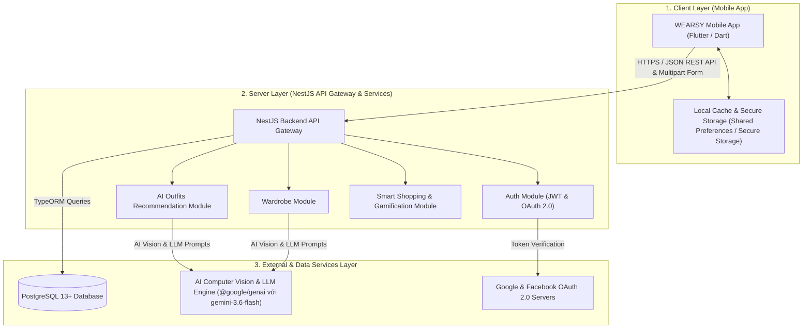
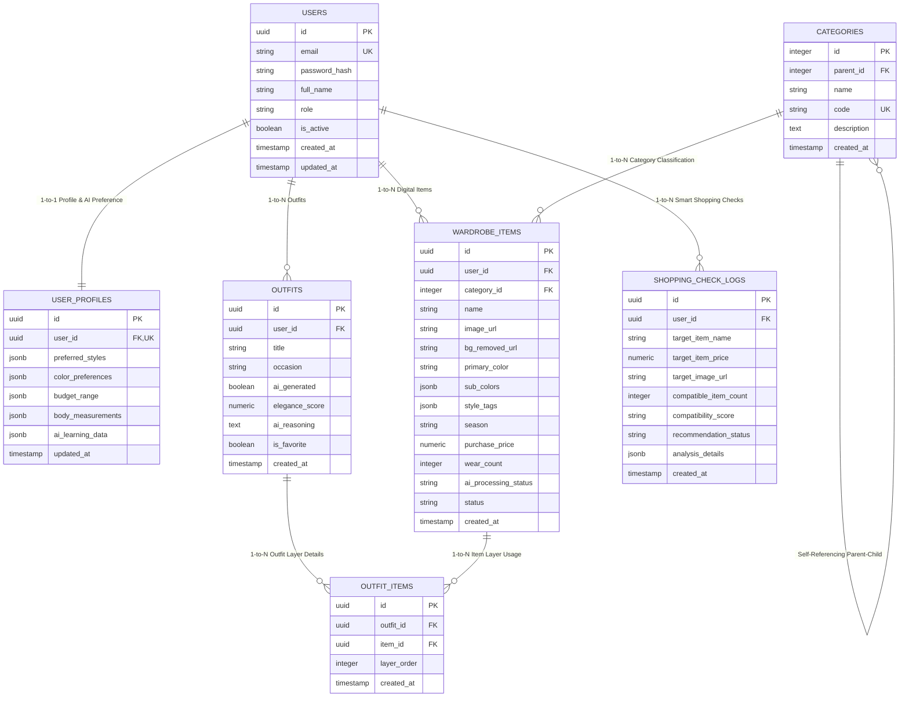
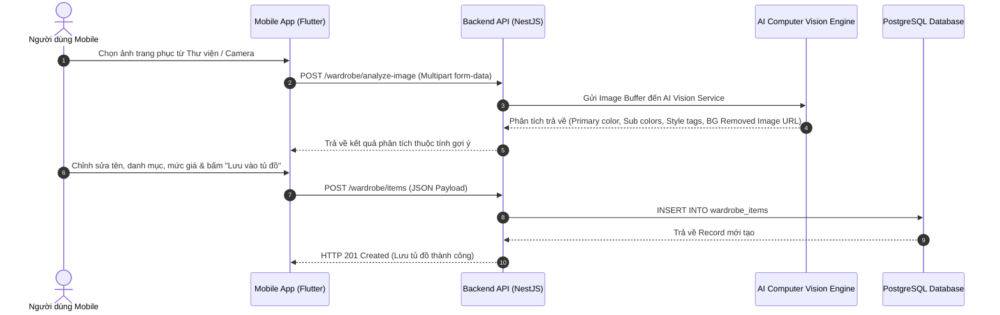
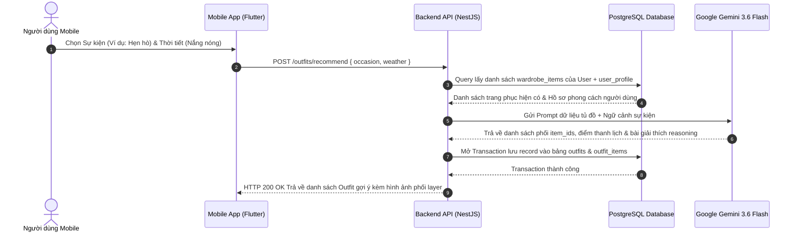

# TÀI LIỆU KỸ THUẬT HOÀN CHỈNH DỰ ÁN WEARSY
## (Technical Specification & Architecture Documentation)

> **Tên dự án:** WEARSY - Smart Wardrobe & AI Fashion Assistant  
> **Mã dự án:** EXE101 - FA26  
> **Chủ trì Kỹ thuật & An toàn Thông tin:** Võ Thế Dân  
> **Phiên bản tài liệu:** v1.0.0  
> **Ngày cập nhật:** 22/09/2026  

---

## 1. Tổng quan Dự án & Mục tiêu Hệ thống

### 1.1. Giới thiệu dự án
**WEARSY** là giải pháp trợ lý thời trang cá nhân và quản lý tủ đồ kỹ thuật số thông minh (Digital Wardrobe Management System), ứng dụng trí tuệ nhân tạo (AI Computer Vision & LLM). Hệ thống giúp người dùng số hóa tủ đồ cá nhân, tự động phân tích trang phục, gợi ý phối đồ cá nhân hóa theo ngữ cảnh/thời tiết, chấm điểm màu sắc theo lý thuyết bánh xe màu sắc (Color Wheel Theory), và kiểm tra độ tương thích của vật phẩm thời trang mới trước khi quyết định mua sắm (Smart Shopping Compatibility Check).

### 1.2. Mục tiêu kỹ thuật
- **Kiến trúc bền vững**: Mô hình Client-Server hiện đại, chia tách hoàn toàn giữa ứng dụng di động Flutter và hệ thống NestJS Backend RESTful API.
- **Xử lý AI thông minh**: Tích hợp Cloudinary AI để tự động tách nền ảnh (Background Removal); kết hợp với AI LLM (Google Gemini 3.6 Flash) để phân tích thuộc tính ảnh, trích xuất màu sắc, phong cách, phân loại trang phục và gợi ý bộ trang phục (Outfit) kèm lập luận cá nhân hóa.
- **Bảo mật chuẩn Doanh nghiệp**: Tuân thủ các nguyên tắc an toàn thông tin OWASP Top 10, xác thực JWT (JSON Web Token), OAuth 2.0 SSO (Google & Facebook), mã hóa mật khẩu Bcrypt, lọc CORS, chống tấn công Brute Force bằng Rate Limiting (Throttler Guard) và bảo vệ Header bằng Helmet.
- **Trải nghiệm di động mượt mà**: Thiết kế theo phong cách Dark Mode sang trọng, hỗ trợ chế độ dùng thử Offline / Fallback Mock linh hoạt và đồng bộ dữ liệu thời gian thực với máy chủ.

---

## 2. Kiến trúc Tổng thể Hệ thống (System Architecture)

### 2.1. Mô hình kiến trúc 3 lớp (3-Tier Architecture)

Dự án WEARSY vận hành theo mô hình 3 lớp phân tách rõ ràng:



### 2.2. Danh sách Môi trường máy chủ (Environments)
- **Production Server**: `https://api.wearsy.app/v1`
- **Staging Server**: `https://staging-api.wearsy.app/v1`
- **Local Dev Server**: `http://localhost:3000/api/v1`
- **Swagger Documentation**: `http://localhost:3000/api/v1/docs`

---

## 3. Công nghệ & Thư viện Sử dụng (Tech Stack)

### 3.1. Mobile Application (Frontend)
- **Framework**: Flutter 3.x (Dart SDK `>=3.0.0 <4.0.0`).
- **Quản lý trạng thái (State Management)**: Provider (`MultiProvider` pattern).
- **Giao diện & UI/UX**:
  - Material Design 3 với Dark Theme mặc định.
  - Phông chữ Google Fonts (`Outfit` cho tiêu đề thương hiệu, `Inter` cho nội dung).
  - Tải ảnh mạng tối ưu caching: `cached_network_image: ^3.3.1`.
  - Hiệu ứng nạp dữ liệu: `flutter_spinkit: ^5.2.0`.
- **Xác thực & Bảo mật di động**:
  - Đăng nhập Google: `google_sign_in: ^6.2.1`.
  - Đăng nhập Facebook: `flutter_facebook_auth: ^7.1.1`.
  - Lưu trữ Token an toàn: `flutter_secure_storage: ^9.0.0`.
  - Lưu trữ cài đặt cục bộ: `shared_preferences: ^2.2.2`.
- **Mạng & Định dạng**: `http: ^1.2.0`, `intl: ^0.19.0`.

### 3.2. Backend Services (Server)
- **Framework**: NestJS v10.3 (Node.js & TypeScript v5.4).
- **Cơ sở dữ liệu & ORM**: TypeORM v0.3 với PostgreSQL Client (`pg: ^8.11.5`).
- **Xác thực & Phân quyền**:
  - Passport JWT: `@nestjs/jwt`, `@nestjs/passport`, `passport-jwt`.
  - Băm mật khẩu: `bcrypt: ^5.1.1`.
- **Bảo mật Server**:
  - Header Protection: `helmet: ^8.3.0`.
  - Giới hạn tần suất truy cập (Rate Limiting): `@nestjs/throttler: ^6.7.0` (Tối đa 10 requests / 60s per client).
  - Validations dữ liệu đầu vào: `class-validator: ^0.14.1`, `class-transformer: ^0.5.1`.
- **Tài liệu hóa API**: `@nestjs/swagger: ^7.3.1`, `swagger-ui-express: ^5.0.0`.
- **Tích hợp Trí tuệ nhân tạo (AI Engine)**: SDK `@google/genai: ^0.1.1` tích hợp mô hình Gemini AI (`gemini-3.6-flash`).
- **Xử lý ảnh & Tách nền tự động (Computer Vision & Storage)**: `cloudinary`, `multer`, `streamifier` với tính năng Cloudinary AI Background Removal (`background_removal: 'cloudinary_ai'`) tự động chuyển đổi ảnh trang phục sang định dạng PNG trong suốt.

### 3.3. Database & Infrastructure
- **Cơ sở dữ liệu RDBMS**: PostgreSQL 13+ hỗ trợ các Extensions `uuid-ossp` và `pgcrypto`.
- **Containerization**: Docker & Docker Compose (`docker-compose.yml`).

---

## 4. Thiết kế Cơ sở Dữ liệu & ERD (Database Design)

Cơ sở dữ liệu PostgreSQL của ứng dụng WEARSY được thiết kế tối ưu hóa theo các chuẩn bảo toàn dữ liệu (Relational Integrity), đánh Index truy vấn hiệu năng cao và lưu trữ thuộc tính linh hoạt bằng định dạng `JSONB`.

### 4.1. Sơ đồ Quan hệ Entity Relationship Diagram (ERD)



### 4.2. Chi tiết Cấu trúc Các Bảng Dữ liệu

Tệp khởi tạo cơ sở dữ liệu hoàn chỉnh nằm tại [`database/schema.sql`](file:///d:/FPTDocuments/FA26/EXE101/Project%20WEARSY/database/schema.sql).

#### Bảng `users` (Tài khoản người dùng)
- `id` (`UUID`, Primary Key, mặc định `gen_random_uuid()`): Định danh người dùng.
- `email` (`VARCHAR(255)`, Unique, Not Null): Email đăng nhập.
- `password_hash` (`VARCHAR(255)`, Not Null): Mật khẩu băm Bcrypt.
- `full_name` (`VARCHAR(100)`, Not Null): Họ và tên hiển thị.
- `role` (`VARCHAR(20)`, Default `'USER'`): Quyền tài khoản (`USER`, `ADMIN`).
- `is_active` (`BOOLEAN`, Default `true`): Trạng thái hoạt động tài khoản.
- `created_at`, `updated_at` (`TIMESTAMP WITH TIME ZONE`): Thời gian tạo và cập nhật tự động bằng Trigger PostgreSQL.

#### Bảng `user_profiles` (Hồ sơ phong cách & Data Học máy AI)
- `id` (`UUID`, Primary Key): Mã hồ sơ.
- `user_id` (`UUID`, Unique, Foreign Key `users(id)` ON DELETE CASCADE): Liên kết 1-1 với tài khoản người dùng.
- `preferred_styles` (`JSONB`, Default `'[]'`): Danh sách phong cách yêu thích (VD: Minimalist, Streetwear, Business Casual).
- `color_preferences` (`JSONB`, Default `'{}'`): Tone màu yêu thích và tone màu né tránh.
- `budget_range` (`JSONB`): Hạn mức ngân sách sắm sửa thời trang.
- `body_measurements` (`JSONB`): Chỉ số vóc dáng cá nhân (chiều cao, cân nặng, tỷ lệ dáng người).
- `ai_learning_data` (`JSONB`): Dữ liệu học máy từ thói quen đánh giá outfit của người dùng.

#### Bảng `categories` (Phân loại trang phục đa cấp)
- `id` (`INTEGER`, Primary Key, Generated Always as Identity): Mã danh mục.
- `parent_id` (`INTEGER`, Foreign Key `categories(id)` ON DELETE SET NULL): Mã danh mục cha (hỗ trợ phân cấp đa tầng).
- `name` (`VARCHAR(100)`, Not Null): Tên danh mục (Áo, Quần & Váy, Giày Dép, Áo Khoác, Phụ Kiện).
- `code` (`VARCHAR(50)`, Unique): Mã code tra cứu nhanh (`TOPS`, `BOTTOMS`, `FOOTWEAR`, `OUTERWEAR`, `ACCESSORIES`).

#### Bảng `wardrobe_items` (Digital Wardrobe - Kho đồ cá nhân)
- `id` (`UUID`, Primary Key): Mã món đồ.
- `user_id` (`UUID`, Foreign Key `users(id)` ON DELETE CASCADE): Chủ sở hữu món đồ.
- `category_id` (`INTEGER`, Foreign Key `categories(id)` ON DELETE RESTRICT): Phân loại trang phục.
- `name` (`VARCHAR(150)`, Not Null): Tên vật phẩm.
- `image_url` (`VARCHAR(512)`, Not Null): Đổ dẫn ảnh gốc upload.
- `bg_removed_url` (`VARCHAR(512)`): Đường dẫn ảnh đã được AI xử lý tách nền PNG.
- `primary_color` (`VARCHAR(50)`, Not Null): Màu sắc chủ đạo.
- `sub_colors` (`JSONB`): Màu sắc phụ.
- `style_tags` (`JSONB`): Nhãn phong cách do AI trích xuất.
- `season` (`VARCHAR(30)`, Default `'ALL'`): Mùa thích hợp (`SUMMER`, `WINTER`, `SPRING`, `AUTUMN`, `ALL`).
- `wear_count` (`INTEGER`, Default `0`): Tần suất / Số lần đã mặc.
- `ai_processing_status` (`VARCHAR(20)`, Default `'COMPLETED'`): Trạng thái xử lý của AI (`PENDING`, `PROCESSING`, `COMPLETED`, `FAILED`).

#### Bảng `outfits` (Bộ trang phục)
- `id` (`UUID`, Primary Key): Mã bộ trang phục.
- `user_id` (`UUID`, Foreign Key `users(id)` ON DELETE CASCADE): Chủ sở hữu outfit.
- `title` (`VARCHAR(150)`): Tên bộ trang phục.
- `occasion` (`VARCHAR(100)`): Ngữ cảnh / Sự kiện (Đi làm, Dự tiệc, Cà phê, Hẹn hò).
- `ai_generated` (`BOOLEAN`, Default `true`): Đánh dấu outfit do AI đề xuất hay người dùng tự phối.
- `elegance_score` (`NUMERIC(3, 1)`): Điểm thanh lịch / thẩm mỹ do AI chấm (Thang điểm 10.0).
- `ai_reasoning` (`TEXT`): Lập luận giải thích lý do phối đồ của AI.
- `is_favorite` (`BOOLEAN`, Default `false`): Đánh dấu bộ đồ yêu thích.

#### Bảng `outfit_items` (Chi tiết phối layer trang phục)
- `id` (`UUID`, Primary Key): Mã dòng chi tiết.
- `outfit_id` (`UUID`, Foreign Key `outfits(id)` ON DELETE CASCADE).
- `item_id` (`UUID`, Foreign Key `wardrobe_items(id)` ON DELETE CASCADE).
- `layer_order` (`INTEGER`, Default `1`): Thứ tự layer mặc (1: Áo trong/Quần, 2: Áo khoác ngoài, 3: Phụ kiện/Giày).
- *Constraint*: `UNIQUE(outfit_id, item_id)` đảm bảo 1 món đồ không bị trùng lặp trong cùng 1 outfit.

#### Bảng `shopping_check_logs` (Nhật ký Smart Shopping Check)
- `id` (`UUID`, Primary Key): Mã lượt kiểm tra.
- `user_id` (`UUID`, Foreign Key `users(id)` ON DELETE CASCADE).
- `target_item_name` (`VARCHAR(150)`): Tên món đồ dự định mua.
- `target_item_price` (`NUMERIC(12, 2)`): Giá tiền món đồ.
- `compatible_item_count` (`INTEGER`): Số món đồ hiện có trong tủ phối hợp ăn ý.
- `compatibility_score` (`VARCHAR(20)`): Điểm tương thích (`HIGH`, `MEDIUM`, `LOW`).
- `recommendation_status` (`VARCHAR(30)`): Khuyên nên mua hay bỏ qua (`SHOULD_BUY`, `CONSIDER`, `SKIP`).
- `analysis_details` (`JSONB`): Chi tiết phân thích lý do & gợi ý phối đồ giả định từ AI.

---

## 5. Chuẩn hóa API & Danh sách Endpoints (API Specification)

Toàn bộ API tuân thủ kiến trúc RESTful, dữ liệu trao đổi bằng định dạng JSON (hoặc `multipart/form-data` đối với Upload ảnh) và xác thực bằng `Authorization: Bearer <JWT_TOKEN>`. Tài liệu chi tiết OpenAPI 3.0 có sẵn tại [`docs/openapi.yaml`](file:///d:/FPTDocuments/FA26/EXE101/Project%20WEARSY/docs/openapi.yaml).

### 5.1. Chuẩn hóa Phản hồi (Standard Response Format)

#### Phản hồi Thành công (HTTP 200 / HTTP 201)
```json
{
  "success": true,
  "code": 200,
  "message": "Thao tác thực hiện thành công.",
  "data": {
    "id": "a0eebc99-9c0b-4ef8-bb6d-6bb9bd380a11",
    "email": "demo@wearsy.app",
    "full_name": "Nguyễn Văn Demo"
  },
  "meta": {
    "timestamp": "2026-09-22T11:53:00Z"
  }
}
```

#### Phản hồi Lỗi (HTTP 400 / 401 / 403 / 404 / 500)
```json
{
  "success": false,
  "code": 400,
  "error": {
    "type": "VALIDATION_ERROR",
    "message": "Dữ liệu đầu vào không hợp lệ.",
    "details": [
      {
        "field": "category_id",
        "issue": "Danh mục trang phục không được bỏ trống."
      }
    ]
  },
  "meta": {
    "timestamp": "2026-09-22T11:53:00Z"
  }
}
```

### 5.2. Ma trận API Endpoints theo Phân hệ

| Phân hệ | HTTP Method | Endpoint URL | Mô tả chức năng | Quyền truy cập |
|---|---|---|---|---|
| **1. Auth & Profile** | `POST` | `/api/v1/auth/send-otp` | Gửi mã OTP xác thực 6 chữ số đến Email đăng ký | Public |
| | `POST` | `/api/v1/auth/verify-otp` | Xác thực mã OTP 6 chữ số nhập từ người dùng | Public |
| | `POST` | `/api/v1/auth/register` | Đăng ký tài khoản người dùng mới (sau khi xác thực OTP) | Public |
| | `POST` | `/api/v1/auth/login` | Đăng nhập bằng Email & Password | Public |
| | `POST` | `/api/v1/auth/google` | Đăng nhập nhanh bằng Google SSO (id_token) | Public |
| | `POST` | `/api/v1/auth/facebook` | Đăng nhập nhanh bằng Facebook SSO (access_token) | Public |
| | `GET` | `/api/v1/users/profile` | Lấy thông tin cá nhân người dùng hiện tại | Authenticated |
| | `PUT` | `/api/v1/users/style-profile` | Cập nhật hồ sơ phong cách & vóc dáng cá nhân | Authenticated |
| **2. Digital Wardrobe** | `POST` | `/api/v1/wardrobe/items` | Thêm món đồ mới vào tủ đồ kỹ thuật số | Authenticated |
| | `POST` | `/api/v1/wardrobe/analyze-image` | Upload ảnh để AI tách nền & trích xuất màu sắc/phong cách | Authenticated |
| | `GET` | `/api/v1/wardrobe/items` | Lấy danh sách đồ trong tủ (hỗ trợ lọc theo category, season) | Authenticated |
| | `GET` | `/api/v1/wardrobe/items/{id}` | Xem chi tiết thông số món đồ | Authenticated |
| | `DELETE` | `/api/v1/wardrobe/items/{id}` | Xóa món đồ khỏi tủ đồ | Authenticated |
| **3. AI Outfits Engine** | `POST` | `/api/v1/outfits/recommend` | Gợi ý bộ outfit thời trang theo sự kiện/thời tiết | Authenticated |
| | `POST` | `/api/v1/outfits/recommend-by-context` | Upload ảnh không gian địa điểm để AI phân tích và gợi ý outfit phù hợp | Authenticated |
| | `POST` | `/api/v1/outfits/{id}/rate` | Đánh giá & chấm điểm outfit để AI học thói quen người dùng | Authenticated |
| | `GET` | `/api/v1/outfits` | Lấy danh sách outfit đã lưu / outfit yêu thích | Authenticated |
| **4. Smart Shopping** | `POST` | `/api/v1/shopping/compatibility-check` | Đánh giá độ tương thích của vật phẩm định mua với tủ đồ hiện có | Authenticated |
| | `GET` | `/api/v1/shopping/missing-items` | Gợi ý danh sách món đồ còn thiếu để tối ưu hóa tủ đồ | Authenticated |
| **5. Gamification** | `POST` | `/api/v1/gamification/color-score` | Chấm điểm phối màu outfit theo quy tắc bánh xe màu sắc | Authenticated |
| | `GET` | `/api/v1/gamification/challenges` | Lấy danh sách thử thách phối đồ theo chủ đề tuần/tháng | Authenticated |

---

## 6. Luồng Nghiệp vụ Chi tiết & Tích hợp AI (Core Workflows)

### 6.1. Luồng Upload Ảnh & AI Phân tích Trang phục (Wardrobe Item Creation)



### 6.2. Luồng Gợi ý Outfit bằng AI (AI Recommendation Engine)



---

## 7. Giải pháp An toàn Thông tin & Bảo mật (Security Measures)

Để bảo vệ ứng dụng trước các nguy cơ an toàn thông tin, hệ thống WEARSY triển khai đầy đủ các cơ chế bảo mật theo tiêu chuẩn OWASP:

1. **Xác thực Chuẩn OAuth 2.0 & JWT Session**:
   - Sử dụng JWT Token có thời gian hết hạn (`JWT_EXPIRATION_TIME=86400s` - 24 giờ).
   - Tích hợp Đăng nhập Mạng xã hội Google & Facebook SSO thông qua việc trao đổi mã Token an toàn (Client SDK lấy Token ➔ Backend xác thực trực tiếp qua Google/Meta APIs).

2. **Mã hóa Mật khẩu người dùng**:
   - Mật khẩu lưu trữ trong bảng `users` bắt buộc được băm bằng thuật toán **Bcrypt** với Salt rounds tiêu chuẩn, không lưu mật khẩu dạng Plain Text.

3. **Chống Tấn công Brute Force & DoS (Rate Limiting)**:
   - Sử dụng `@nestjs/throttler` cấu hình toàn cục (`ThrottlerGuard`).
   - Tối đa **10 lượt gọi API trong vòng 60 giây** cho mỗi IP / Client để chống lại các đợt quét tự động hoặc tấn công dò mật khẩu.

4. **Bảo vệ HTTP Security Headers**:
   - Sử dụng thư viện `helmet` trên NestJS để bật các HTTP Headers phòng thủ: `X-Frame-Options` (chống Clickjacking), `X-XSS-Protection`, `Strict-Transport-Security` (HSTS), và loại bỏ Header `X-Powered-By`.

5. **Kiểm duyệt & Lọc Dữ liệu đầu vào (Input Validation & Sanitization)**:
   - Tích hợp `ValidationPipe` toàn cục trong NestJS với tùy chọn `whitelist: true` và `forbidNonWhitelisted: true`. Bất kỳ field dữ liệu không nằm trong đặc tả DTO đều bị từ chối tự động.

6. **Giới hạn Nguồn truy cập (CORS Protection)**:
   - Hệ thống Backend chỉ chấp nhận các Yêu cầu kết nối đến từ danh sách Domain Origin được phép trong cấu hình `ALLOWED_ORIGINS`.

---

## 8. Cấu trúc Mã nguồn Dự án (Source Code Structure)

### 8.1. Cấu trúc Backend NestJS (`wearsy-backend/`)

```text
wearsy-backend/
├── .env.example              # Tệp mẫu biến môi trường
├── docker-compose.yml        # Cấu hình khởi chạy Docker PostgreSQL & Backend
├── nest-cli.json             # Cấu hình NestJS CLI
├── package.json              # Danh sách dependencies & scripts
├── tsconfig.json             # Cấu hình TypeScript
└── src/
    ├── main.ts               # Entrypoint ứng dụng NestJS (Cors, Helmet, Swagger, Pipes)
    ├── app.module.ts         # Module gốc cấu hình Throttler, Config & Database
    ├── database/
    │   └── database.config.ts# Cấu hình kết nối TypeORM PostgreSQL
    └── modules/
        ├── users/            # Module quản lý Người dùng & Profile
        ├── wardrobe/         # Module Tủ đồ kỹ thuật số & AI Vision Upload
        ├── outfits/          # Module Gợi ý Outfit bằng AI LLM Engine
        └── shopping/         # Module Kiểm tra Tương thích Mua sắm Thông minh
```

### 8.2. Cấu trúc Mobile Flutter (`wearsy_mobile/`)

```text
wearsy_mobile/
├── pubspec.yaml              # Cấu hình gói và thư viện Flutter
└── lib/
    ├── main.dart             # Entrypoint khởi chạy Flutter App & AuthWrapperScreen
    ├── core/
    │   ├── constants/        # Hằng số API URL, Colors & Dimensions
    │   ├── mock/             # Dữ liệu Mock Offline Demo
    │   ├── network/          # HTTP Client Service & Interceptors
    │   ├── storage/          # Secure Storage Manager & Local Cache
    │   └── theme/            # Cấu hình AppTheme Dark Mode & Fonts
    └── features/
        ├── auth/             # Màn hình & Provider Đăng nhập, Đăng ký, Google/FB SSO
        ├── home/             # Màn hình Navigation Bar & Trang chủ Tổng quan
        ├── wardrobe/         # Màn hình Tủ đồ, Xem chi tiết & Thêm món đồ
        ├── outfits/          # Màn hình Gợi ý Outfit AI & Chấm điểm Màu sắc
        └── profile/          # Màn hình Hồ sơ cá nhân & Cài đặt Vóc dáng
```

---

## 9. Hướng dẫn Cài đặt, Đóng gói & Chạy Demo

### 9.1. Yêu cầu Môi trường (Prerequisites)
- **Node.js**: `v20.x` trở lên & `npm` / `yarn`.
- **Flutter SDK**: `v3.19.x` trở lên (Dart SDK `>=3.0.0 <4.0.0`).
- **PostgreSQL**: `v13.0` trở lên (Hoặc Docker Desktop).

### 9.2. Khởi chạy Backend Server (NestJS & PostgreSQL)

1. **Khởi tạo cơ sở dữ liệu PostgreSQL**:
   - Sử dụng Docker Compose:
     ```bash
     cd wearsy-backend
     docker-compose up -d
     ```
   - Hoặc nạp trực tiếp tệp Schema vào PostgreSQL cục bộ:
     ```bash
     psql -U postgres -d wearsy_db -f ../database/schema.sql
     ```

2. **Cài đặt dependencies và chạy Backend**:
   ```bash
   cd wearsy-backend
   cp .env.example .env
   npm install
   npm run start:dev
   ```
   - Sau khi khởi tạo thành công, Swagger UI sẵn sàng tại: `http://localhost:3000/api/v1/docs`

### 9.3. Khởi chạy Mobile App (Flutter)

1. **Cài đặt thư viện dependencies**:
   ```bash
   cd wearsy_mobile
   flutter pub get
   ```

2. **Khởi chạy ứng dụng**:
   ```bash
   # Chạy ứng dụng di động trên thiết bị giả lập hoặc thật
   flutter run
   ```

### 9.4. Danh sách Tài khoản Test & Demo sẵn có
Tài liệu danh sách tài khoản demo và chế độ offline sẵn có tại [`docs/demo account`](file:///d:/FPTDocuments/FA26/EXE101/Project%20WEARSY/docs/demo%20account):

- **Tài khoản Demo chính**:
  - Email: `demo@wearsy.app`
  - Mật khẩu: `123456`
  - *Ghi chú*: Tài khoản đã được nạp sẵn 12 vật phẩm tủ đồ mẫu, 5 bộ outfit AI phối sẵn và hồ sơ phong cách cá nhân hoàn chỉnh.
- **Tài khoản Đăng nhập nhanh SSO**: Bấm nút **Google** hoặc **Facebook** dưới khung đăng nhập để vào ngay chế độ demo.
- **Chế độ Offline Mode**: Nhập bất kỳ email nào chứa từ khóa `demo` hoặc `test` với mật khẩu chính xác là `123456` để trải nghiệm ứng dụng offline. Nhập sai mật khẩu sẽ bị hệ thống từ chối và báo lỗi.
- **Bảo mật chống dò mật khẩu (Rate Limiting)**: Nhập sai 5 lần liên tiếp sẽ tạm làm mờ nút đăng nhập và khóa trong 1 phút; nhập sai 10 lần liên tiếp sẽ khóa 5 phút kèm đồng hồ đếm ngược.

---

## 11. Tính Năng Đột Phá: Layering Canvas 2D & Smart Fit (Vóc Dáng & Chiều Cao)

### 11.1. Kiến trúc Tổng thể (3 Tầng Xử lý Tuần tự)

```
[User Input: Chiều cao, Cân nặng, Giới tính] 
                │
                ▼
[1. Deterministic Engine: Tính BMI & Ước tính Size/Tỷ lệ] (Local / Backend < 5ms)
                │
                ▼
[2. AI Context Engine: Phân tích Phối đồ + Thẩm mỹ vóc dáng] (Gemini 1.5 Flash)
                │
                ▼
[3. Layering Canvas 2D Engine: Sắp xếp lớp hiển thị trên UI] (Flutter Interactive Canvas)
```

### 11.2. Bước 1: Thuật toán Thể trạng Chuẩn Châu Á (Deterministic Sizing Logic)
Thực hiện ngay trên client/server trong vòng `< 5ms`:
1. **Chỉ số BMI**: $\text{BMI} = \frac{\text{Cân nặng (kg)}}{(\text{Chiều cao (m)})^2}$
2. **Phân loại vóc dáng (Asian Standard Body Frame)**:
   - $\text{BMI} < 18.5$: Gầy (`Slim` / `Underweight`)
   - $18.5 \le \text{BMI} < 23.0$: Cân đối (`Fit` / `Standard`)
   - $23.0 \le \text{BMI} < 25.0$: Hơi thừa cân (`Overweight` / `Plump`)
   - $\text{BMI} \ge 25.0$: Đầy đặn (`Plus-size`)
3. **Ánh xạ Size chuẩn**:
   - *Nữ*: Cao 1m50 - 1m58, Nặng 40 - 47kg $\rightarrow$ Size S.
   - *Nữ*: Cao 1m58 - 1m65, Nặng 48 - 54kg $\rightarrow$ Size M.
   - *Nam*: Cao 1m60 - 1m68, Nặng 50 - 60kg $\rightarrow$ Size M.
   - *Nam*: Cao 1m68 - 1m78, Nặng 60 - 72kg $\rightarrow$ Size L.
4. **Cảnh báo độ dài (Length Hazard Detection)**:
   - Nữ $< 155\text{ cm}$ chọn Quần dài/Đầm maxi: Kích hoạt cờ `FLAG_MAY_BE_LONG` (Nguy cơ quệt gót).
   - Nam $> 180\text{ cm}$ chọn Quần tây regular: Kích hoạt cờ `FLAG_MAY_BE_SHORT` (Nguy cơ cộc mắt cá).

### 11.3. Bước 2: Thứ tự Xếp lớp & Tỷ lệ Co giãn (2D Layering Engine)
- **Z-Index (Layer Order)**:
  - `layer_order = 1`: Lớp nền (Áo thun, sơ mi, quần tây, chân váy, đầm liền).
  - `layer_order = 2`: Lớp ngoài (Áo khoác, Blazer, Cardigan, Trench coat, Denim jacket).
  - `layer_order = 3`: Giày / Dép (Sneakers, Loafers, Boots, Sandal).
  - `layer_order = 4`: Phụ kiện (Mũ, túi xách, đồng hồ, kính).
- **Scale Ratio**: $\text{Scale Ratio} = \frac{\text{Chiều cao người dùng}}{165\text{ cm}}$ (Giới hạn từ $0.85$ đến $1.18$ để cân đối màn hình).

### 11.4. Bước 3: Giao diện Người dùng (UI Experience)
- **Khung Layering 2D Canvas**: Khung vẽ nghệ thuật studio với lưới tọa độ, thước đo chiều cao động, thẻ Z-index và cho phép chạm bật/tắt từng lớp trang phục trực quan.
- **Thẻ Smart Fit**: Hiển thị Form dáng chuẩn, Mẹo tôn dáng (Body proportion tip), Cảnh báo tỷ lệ, Thang điểm Thanh lịch (Elegance) và Hài hòa màu sắc (Color score).
- **Điều chỉnh thể trạng trực tiếp**: Hỗ trợ thanh trượt Chiều cao & Cân nặng ngay trên màn hình chi tiết để thử nghiệm khả năng thích ứng thời gian thực của AI.

3. Kết nối mạng xã hội thời trang cho phép người dùng chia sẻ tủ đồ và outfit hàng ngày (Social Fashion Feed).

---
*Tài liệu được biên soạn bởi Võ Thế Dân - Phụ trách Kỹ thuật & An toàn thông tin Dự án WEARSY.*
