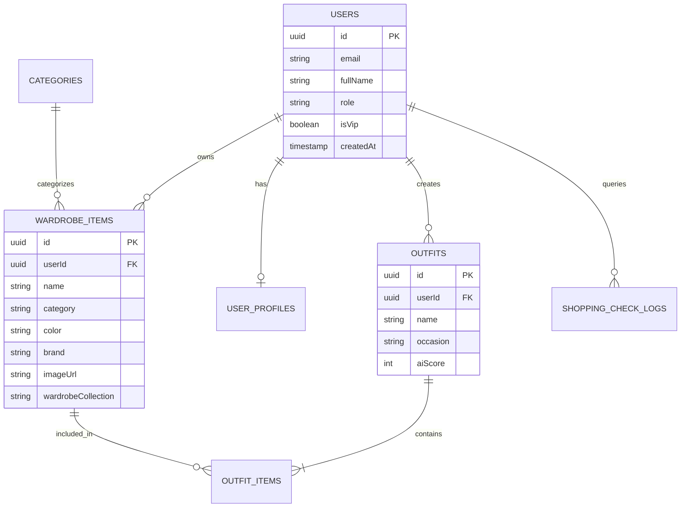

# WEARSY - Báo Cáo Cấu Trúc & Dữ Liệu Cơ Sở Dữ Liệu (Database Report)

> **Dự án:** WEARSY - Trợ lý Thời trang Thông minh & Tủ đồ Ảo (EXE101)
> **Hệ quản trị CSDL:** PostgreSQL 15+ (Triển khai trên Supabase Cloud Singapore - AWS ap-southeast-1)
> **Thời điểm trích xuất:** 20:04:20 4/10/2026
> **Định dạng tải về:** 
> - File SQL Dump hoàn chỉnh: [`wearsy_database_dump.sql`](./wearsy_database_dump.sql)
> - File JSON Data: [`wearsy_database_data.json`](./wearsy_database_data.json)

## 1. Sơ Đồ Thực Thể Liên Kết (Entity Relationship Diagram - ERD)



## 2. Thống Kê Tổng Quan Các Bảng

| Tên Bảng | Ý Nghĩa / Mục Đích Nghiệp Vụ | Số Lượng Cột | Số Dòng Hiện Tại |
| :--- | :--- | :---: | :---: |
| `users` | Lưu trữ tài khoản, phân quyền (USER/ADMIN), trạng thái VIP và bảo mật | 11 | **4** |
| `user_profiles` | Thông tin số đo cơ thể, phong cách ưa thích và sở thích thời trang cá nhân | 8 | **0** |
| `categories` | Danh mục chuẩn hóa thời trang (Tops, Bottoms, Outerwear, Shoes, Accessories) | 6 | **0** |
| `wardrobe_items` | Danh sách các món đồ trong tủ đồ thông minh của người dùng (áo, quần, giày...) | 19 | **8** |
| `outfits` | Các bộ phối đồ do AI đề xuất hoặc người dùng tự mix-match trong phòng thử đồ | 10 | **0** |
| `outfit_items` | Bảng trung gian liên kết n-n giữa Outfits và Wardrobe Items | 5 | **0** |
| `shopping_check_logs` | Lịch sử phân tích URL sản phẩm Shopee/Tiki/Lazada từ tính năng Smart Shopping AI | 10 | **0** |

## 3. Dữ Liệu Chi Tiết Trong Các Bảng Đang Hoạt Động

### 3.1. Bảng `users` (Người dùng)

| ID | Email | Họ & Tên | Vai trò | Trạng thái VIP | Ngôn ngữ | Ngày tạo |
| :--- | :--- | :--- | :---: | :---: | :---: | :--- |
| `0ba850b6...` | **savageflame5764@dustmail.net** | N/A | `USER` | Miễn phí | `vi` | N/A |
| `1a9d1e4a...` | **megasable8920@dustmail.net** | N/A | `USER` | Miễn phí | `vi` | N/A |
| `d140b5f9...` | **acondog468@gmail.com** | N/A | `USER` | Miễn phí | `vi` | N/A |
| `d9944be7...` | **velvetray7847@dustmail.net** | N/A | `USER` | Miễn phí | `vi` | N/A |

### 3.2. Bảng `wardrobe_items` (Món đồ tủ đồ)

| ID | Tên trang phục | Phân loại | Màu sắc | Thương hiệu | Bộ sưu tập tủ | Hình ảnh Cloudinary / Demo |
| :--- | :--- | :---: | :---: | :---: | :---: | :--- |
| `5daac710...` | **Áo Thời Trang Thiết Kế** | `undefined` | N/A | N/A | `Tủ đồ chính` | Không có |
| `3a70c7fa...` | **Áo Thời Trang Thiết Kế** | `undefined` | N/A | N/A | `Tủ đồ chính` | Không có |
| `42165f13...` | **Áo Thời Trang Thiết Kế** | `undefined` | N/A | N/A | `Tủ đồ chính` | Không có |
| `a4bb3c21...` | **Áo Thun Nam Cổ Tròn Màu Đen Basic** | `undefined` | N/A | N/A | `Tủ đồ chính` | Không có |
| `35b48c12...` | **Áo Thời Trang Thiết Kế** | `undefined` | N/A | N/A | `Tủ đồ chính` | Không có |
| `a9b4ab21...` | **Áo Thun Nam Cổ Tròn Màu Đen Basic** | `undefined` | N/A | N/A | `Tủ đồ chính` | Không có |
| `6394525e...` | **Áo Thun Cotton Form Rộng In Hình** | `undefined` | N/A | Local Brand | `Tủ đồ chính` | Không có |
| `f1663275...` | **Áo Sweater Frozen Shark Nỉ Bông Cotton 100 Unisex Local Brand** | `undefined` | N/A | Frozen Shark | `Tủ đồ chính` | Không có |

## 4. Hướng Dẫn Thầy/Cô Khôi Phục & Chạy Thử Cơ Sở Dữ Liệu

Thầy/Cô có thể dễ dàng kiểm tra hoặc khôi phục CSDL WEARSY bằng 1 trong các cách sau:

### Cách 1: Sử dụng công cụ đồ họa (DBeaver / pgAdmin / Navicat)
1. Mở phần mềm **DBeaver** hoặc **pgAdmin**.
2. Tạo một kết nối PostgreSQL hoặc tạo database mới tên `wearsy_db`.
3. Mở file [`wearsy_database_dump.sql`](./wearsy_database_dump.sql) trong trình soạn thảo SQL.
4. Bấm **Execute Script (F5)** để tự động tạo toàn bộ cấu trúc bảng và nạp dữ liệu mẫu.

### Cách 2: Sử dụng dòng lệnh PostgreSQL (psql CLI)
```bash
psql -h <host> -U <username> -d <database_name> -f "docs/database/wearsy_database_dump.sql"
```

### Cách 3: Kết nối trực tiếp vào Database Cloud Supabase
- **Host:** `aws-0-ap-southeast-1.pooler.supabase.com`
- **Port:** `6543`
- **Database:** `postgres`
- **Username:** `postgres.stayzimhtxxbdkpssthk`
- **SSL Mode:** `Require` (True)
